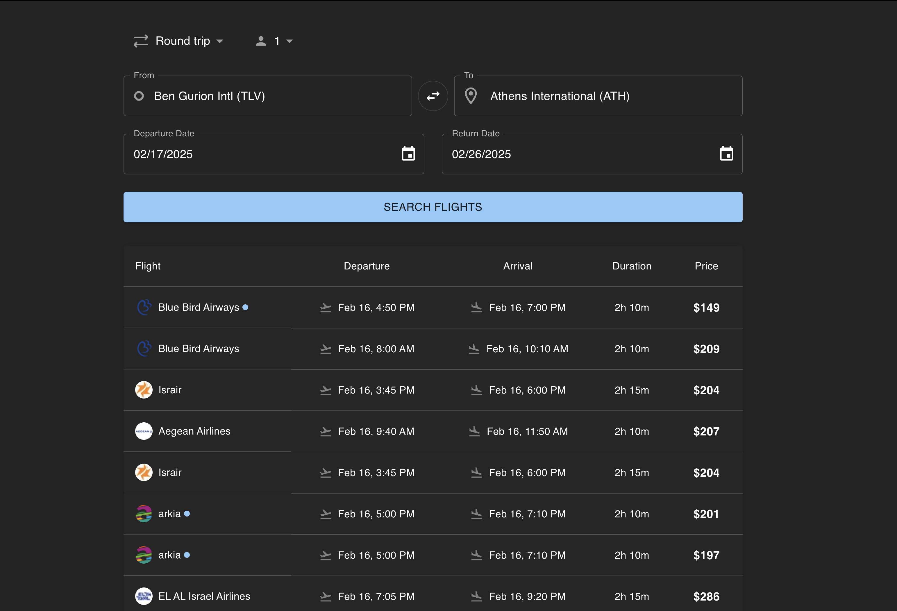

# ✈️ Flight Search App  

A modern flight search application that allows users to find and compare flights easily.



---

### **Motivation**  

The goal of this project is to create a **fast, user-friendly, and reliable** flight search tool inspired by Google Flights.  
This project aims to:  
**Enhance usability** – Clean UI with clear flight details.  
**Ensure accuracy** – Fetch real-time flight data via an external API.  
**Improve performance** – Debounced search queries and efficient state management.  
**Reduce API load** – Cache results to minimize redundant API calls.  

---

### **Tech Stack**  

- **Frontend:** React (Vite) + TypeScript  
- **UI Components:** MUI (`@mui/x-date-pickers`) for date selection  
- **State Management:** React Hooks (`useState`, `useEffect`, `useMemo`)  
- **Validation:** Zod (ensuring correct form inputs)  
- **API Integration:** Sky-Scrapper API (fetching real-time flights)  
- **Icons:** React Icons (`react-icons/md`)  

---

### **Technologies & Decision Making**  

**Vite + React**  
Chosen for its fast development experience and optimized build output.  

**MUI for UI**  
Provides an accessible and consistent design system, reducing development time with prebuilt components.  

**Zod for Validation**  
Ensures correct input validation before making API calls, preventing unnecessary errors and enhancing reliability.  

---

### **How to Run**  


```sh
# Install Dependencies  
npm install
```


```sh
# Start the Development Server
npm install
```

**Open in browser:**<br />
Visit http://localhost:5173

--- 

### ⚠️ Potential Improvements

🔹 Add sorting and filtering options.<br />
🔹 Implement pagination for large result sets.<br />
🔹 Improve caching mechanism for better performance.